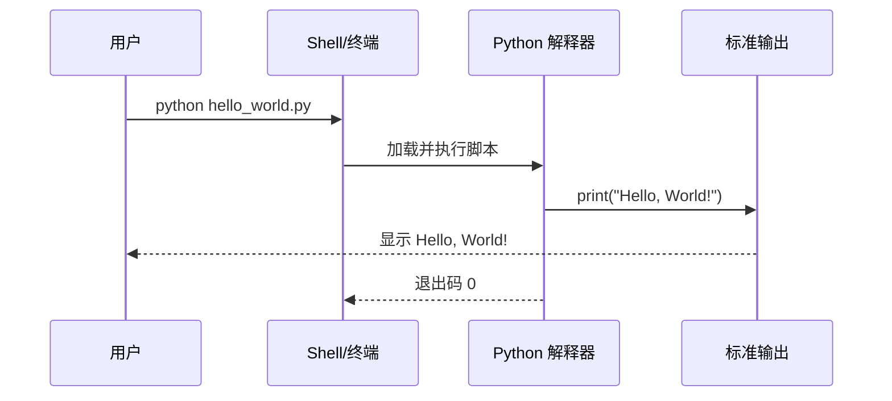

# HelloWorld Python 脚本 系分设计

## 文档元信息

| 项目 | 内容 |
|------|------|
| 文档版本 | v1.0 |
| 作者 | AiWork |
| 创建日期 | 2026-08-27 |
| 需求来源 | 用户口头需求：帮我写个helloworld的py脚本 |
| 评审状态 | 待评审 |

## 1. 需求与范围

### 背景与目标

- 用户希望获得一个最基础、可直接运行的 Python 脚本，用于验证 Python 运行环境是否可用，并作为后续开发的入门/冒烟示例。
- 目标：脚本运行后在标准输出打印 `Hello, World!`，退出码为 0（成功）。

### 核心功能

- 执行 `hello_world.py`，在控制台输出问候语。

### 约束与非功能要求

- 依赖 Python 3 标准库，不引入任何第三方依赖。
- 支持跨平台（Windows / Linux / macOS）。
- 脚本应简单、可读、无副作用，运行耗时可忽略。

### 排除范围

- 不涉及输入参数、配置文件、Web 服务、数据库、日志框架等任何扩展能力。

### 需求功能清单与优先级

| 编号 | 功能点 | 优先级 | PRD 原始描述/章节 | 备注 |
|------|--------|--------|-------------------|------|
| F01 | 输出问候语 | P0 | 用户需求：helloworld | 打印 Hello, World! |
| F02 | 正常运行退出 | P0 | 用户需求：helloworld | 退出码 0，无报错 |

### 假设与待确认项

| 编号 | 假设/待确认内容 | 当前假设 | 确认状态 |
|------|-----------------|----------|----------|
| A01 | 问候语文案 | 采用标准 Hello, World! | 待确认（可自定义，不影响流程） |
| A02 | Python 版本 | 假设环境已安装 Python 3 | 待确认（运行时校验） |

## 2. 架构与模块

### 功能架构

本脚本为单文件、单函数级简单程序，无模块划分需求。

**模块清单**

| 模块 | 职责 | 依赖 |
|------|------|------|
| hello_world | 输出问候语 | Python 标准库（无第三方依赖） |

### 应用集成架构

本项不适用，原因：脚本为独立单文件程序，不与其他系统、服务或中间件存在集成调用关系。

### 部署架构

本项不适用，原因：脚本不涉及服务化部署，仅需在执行环境中安装 Python 3 解释器后直接运行，无多实例、负载均衡、数据层等部署形态。

## 3. 数据模型与存储

本项不适用，原因：脚本不涉及任何数据持久化、数据库或缓存/MQ 存储需求，无实体模型。

## 4. 接口设计

本项不适用，原因：脚本为命令行程序，不对外暴露 oneapi、OpenAPI、内部 Service、集成 Integration 等任何接口。

## 5. 功能模块设计

### 5.1 hello_world 模块

#### 5.1.1 表结构设计

本模块无枚举/常量定义，也无数据表。

本项不适用，原因：模块无任何数据存储与有限取值字段需求。

#### 5.1.2 接口详细设计

本项不适用，原因：模块不对外提供 HTTP/RPC 接口，仅有命令行入口。

#### 5.1.3 子功能详细设计

##### 5.1.3.1 输出问候语（F01）

- 处理时序图

**业务规则：**
| 规则编号 | 规则描述 | 校验时机 | 不满足时的处理 |
|----------|----------|----------|--------------|
| R01 | 脚本应以 UTF-8 编码保存 | 执行前 | 若编码异常，解释器报 SyntaxError |
| R02 | 脚本任何时候都不得抛出未捕获异常 | 运行中 | 若异常，退出码非 0 并输出堆栈 |

**异常场景：**
| 异常场景 | 处理方式 |
|----------|----------|
| Python 未安装 | 执行 `python` 时提示 command not found，需安装 Python 3 |
| 编码不一致 | 统一使用 UTF-8，避免 Windows 默认编码差异 |
| 缩进错误 | 遵守 Python 缩进规范，避免 IndentationError |

**并发控制（如涉及数据写入）：**
- 无并发风险，原因：脚本为只读输出的纯函数式打印，无状态、无共享数据、无写入操作。

**状态机设计：**
- 无状态字段，原因：脚本一次性执行并退出，不存在状态流转。

## 6. 非功能性需求设计

### 6.1 高可用性

本项不适用，原因：脚本是离线单次执行的命令行程序，无服务可用性要求；即便运行失败，仅影响本次输出，不构成对外服务不可用。

### 6.2 可扩展性

本项不适用，原因：用户需求仅为最小 helloworld 示例，未提出扩展需求；后续如需扩展可通过抽取 `main()` 函数及模块化实现。

### 6.3 稳定性/可靠性

- 脚本逻辑单一，执行结果确定（每次均打印同一文案），满足稳定性要求；运行耗时可忽略，不涉及性能边界问题。

### 6.4 安全性设计

#### 6.4.1 账户系统方案

本项不适用，原因：脚本无登录、注册、鉴权等账户能力需求。

#### 6.4.2 授权&访问控制

本项不适用，原因：脚本不涉及数据库查询或受保护资源访问，无水平/垂直权限、登录态检查需求。

#### 6.4.3 数据防护方案

本项不适用，原因：脚本不处理、不存储、不展示任何敏感数据，无加密与脱敏需求。

### 6.5 监控/统计/日志/告警

本项不适用，原因：脚本为一次性命令行工具，无服务监控、告警、日志链路需求；其运行结果由用户直接查看输出即可。

## 7. 变更三板斧

### 7.1 可监控

本项不适用，原因：脚本无服务埋点与监控链路；本阶段无需监控设计。

### 7.2 可灰度

本项不适用，原因：脚本无流量入口与多租户概念，不具备灰度引流场景。

### 7.3 可应急

本项不适用，原因：脚本无在线服务与旧逻辑切换需求；若输出异常，最直接的应急方式为检查 Python 环境与脚本内容后重跑，无需回滚机制。

## 8. 方案检查

| 检查项 | 结果 |
|--------|------|
| 模块划分合理性检查 | 通过（单模块单一职责） |
| 依赖关系合理性 | 不适用（无集成依赖） |
| 单点问题检查（部署层面） | 不适用（无部署架构） |
| 表模型设计范式检查 | 不适用（无数据表） |
| 隐私安全检查 | 不适用（无敏感数据） |
| 兼容性检查（接口） | 不适用（无对外接口） |
| 兼容性检查（表） | 不适用（无数据表） |
| 数据迁移检查 | 不适用（无数据迁移） |
| 一致性检查（功能点） | 通过（F01/F02 均有对应设计） |
| 一致性检查（表） | 不适用（无实体） |
| 一致性检查（接口） | 不适用（无接口） |
| 一致性检查（枚举） | 不适用（无枚举） |
| 状态机完整性检查 | 不适用（无状态字段） |
| 并发风险检查 | 不适用（纯只读输出，无并发风险） |
| 单点问题检查（定时任务层面） | 不适用（无定时任务） |
| 非功能性设计可行性检查 | 通过（无外部依赖，可行性高） |
| 变更三板斧可行性（可监控） | 不适用 |
| 变更三板斧可行性（可灰度） | 不适用 |
| 变更三板斧可行性（可应急） | 不适用 |

✅ 系分设计完成，最终文档：`.agents/20260827-帮我写个helloworld的py脚本/design.md`
