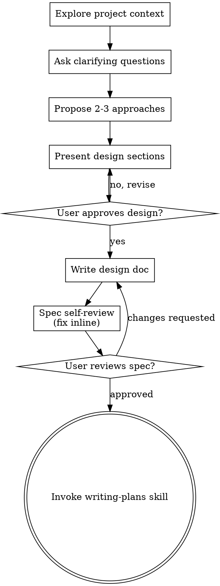

# Brainstorming Skill 使用文档

## 概述

**Brainstorming Skill** 是一个在执行任何创意工作之前必须调用的技能。它的核心作用是：在开始实现之前，系统性地探索用户意图、需求和设计方案，避免直接跳入编码导致的方向性错误。

**强制使用场景：**
- 创建新功能
- 构建组件
- 添加功能逻辑
- 修改现有行为

---

## 核心价值

1. **避免理解偏差** - 通过结构化提问澄清真实需求
2. **探索设计选项** - 强制提出 2-3 个方案并说明权衡
3. **增量验证** - 分段展示设计，逐段获取确认
4. **YAGNI 原则** - 在设计阶段就剔除不必要的功能
5. **平滑过渡** - 完成后自动过渡到 `writing-plans` 技能进入实现阶段

---

## 标准执行流程

### 流程图



### 执行检查清单（必须按顺序完成）

| 序号 | 步骤 | 说明 |
|------|------|------|
| 1 | **探索项目上下文** | 检查文件、文档、最近的提交记录 |
| 2 | **适时提供视觉伴侣** | 仅当问题适合可视化时，在合适的时机提出 |
| 3 | **提出澄清问题** | 一次一个问题，理解目的/约束/成功标准 |
| 4 | **提出 2-3 个方案** | 带权衡分析，给出推荐和理由 |
| 5 | **展示设计** | 分段展示，每段后确认；根据复杂度调整详略 |
| 6 | **编写设计文档** | 保存至 `docs/superpowers/specs/YYYY-MM-DD-<topic>-design.md` 并提交 |
| 7 | **文档自查** | 检查占位符、矛盾、歧义、范围 |
| 8 | **用户审查文档** | 请求用户审查 spec 文件 |
| 9 | **过渡到实现** | 调用 `writing-plans` 技能创建实现计划 |

---

## 关键原则

| 原则 | 说明 |
|------|------|
| **一次一个问题** | 不要用多个问题淹没用户 |
| **多选题优先** | 比开放式问题更容易回答 |
| **YAGNI 严格执行** | 从设计中剔除所有不必要的功能 |
| **探索替代方案** | 在确定方案前必须提出 2-3 个选择 |
| **增量验证** | 展示设计后获取批准再继续 |
| **保持灵活** | 发现不合理处及时回溯澄清 |

---

## 分阶段详细指南

### 阶段一：理解想法

1. **检查项目当前状态**
   - 文件结构
   - 文档内容
   - 最近提交记录

2. **评估范围**
   - 若请求包含多个独立子系统（如"构建包含聊天、文件存储、计费、分析的平台"），立即标记
   - 协助用户分解为子项目，确定构建顺序
   - 对每个子项目单独执行 brainstorming 流程

3. **提出澄清问题**
   - 一次仅提一个问题
   - 优先使用多选题
   - 聚焦于：目的、约束、成功标准

### 阶段二：探索方案

1. **提出 2-3 个方案**
   - 说明权衡分析
   - 给出推荐选项和理由
   - 以推荐选项开头并解释原因

### 阶段三：展示设计

1. **分段展示**
   - 每段后询问是否正确
   - 根据复杂度调整详略：
     - 简单部分：几句话
     - 复杂部分：200-300 字

2. **必须覆盖的内容**
   - 架构
   - 组件
   - 数据流
   - 错误处理
   - 测试策略

3. **设计边界和清晰性**
   - 将系统拆分为单一职责的小单元
   - 通过定义清晰的接口通信
   - 每个单元应能回答：做什么、怎么用、依赖什么
   - 边界清晰性测试：能否不看内部就理解单元功能？能否修改内部而不破坏调用方？

### 阶段四：在现有代码库中工作

1. **先探索后提议**
   - 提议变更前先探索现有结构
   - 遵循现有模式

2. **有针对性的改进**
   - 若现有代码存在问题（如文件过大、边界不清、职责纠缠），将针对性改进纳入设计
   - 不提议无关的重构，聚焦于当前目标

---

## 视觉伴侣（Visual Companion）

### 什么是视觉伴侣？

一个基于浏览器的伴侣工具，用于在 brainstorming 过程中展示模型、图表和可视化选项。它是一个工具，不是模式。

### 何时提供？

- **不要提前提供**
- 等到某个问题真正适合可视化展示时再提出（模型/布局/图表问题，而非仅仅涉及 UI 话题）
- 第一次遇到此类问题时，单独发送一条消息提出：

  > "接下来的部分如果展示出来可能更清晰 —— 我可以在浏览器标签中展示模型、图表和对比。这是新功能且可能消耗较多 token。需要我打开吗？"

- **这条提议必须是单独的消息** —— 不包含其他问题或内容
- 等待用户响应：
  - 若同意：使用 `--open` 启动服务器，浏览器自动打开首页
  - 若拒绝：继续纯文本对话，不再重复提议

### 每个问题的决策

即使用户同意使用视觉伴侣，也需**针对每个问题单独判断**使用浏览器还是终端：

| 使用浏览器 | 使用终端 |
|-----------|---------|
| 模型、线框图、布局对比 | 需求问题、概念选择 |
| 架构图、可视化设计 | 权衡列表、文本选项 A/B/C/D |
| 适合**看**的内容 | 适合**读**的内容 |

**注意**：UI 话题不等于视觉问题。"个性在此上下文中指什么？"是概念问题 → 使用终端。"哪种向导布局更好？"是视觉问题 → 使用浏览器。

---

## 终止状态

**唯一合法的终止状态是调用 `writing-plans` 技能。**

- ❌ 不调用 `frontend-design`
- ❌ 不调用 `mcp-builder`
- ❌ 不调用其他实现类技能
- ✅ 只调用 `writing-plans`

---

## 设计文档自查清单

在提交设计文档给用户审查前，快速检查：

- [ ] 无占位符（如 `TBD`、`TODO`）
- [ ] 无内部矛盾
- [ ] 无歧义表述
- [ ] 范围合理，未超出需求
- [ ] 符合 YAGNI 原则
- [ ] 架构、组件、数据流、错误处理、测试均已覆盖

---

## 常见错误与纠正

| 错误 | 纠正 |
|------|------|
| 跳过上下文探索直接提问 | 先检查文件、文档、提交记录 |
| 一次提出多个问题 | 拆分为多个独立问题，一次一个 |
| 只提出一个方案 | 强制提出 2-3 个方案并说明权衡 |
| 在设计阶段包含无关重构 | 聚焦当前目标，仅改进相关工作范围内的代码 |
| 提前提供视觉伴侣 | 等待真正适合可视化的问题出现时再提议 |
| 调用其他实现技能 | 只能调用 `writing-plans` 过渡到实现阶段 |

---

## 示例场景

### 场景：为现有系统添加缓存层

**错误流程：**
```
用户："添加缓存层"
Agent："好的，我将在 Service 层添加 Redis 缓存..."
```

**正确流程：**
```
用户："添加缓存层"
Agent：
  1. 检查现有架构 → [发现 Service 层、Repository 层]
  2. 提问："主要性能瓶颈在哪里？"
     a) 数据库查询
     b) 外部 API 调用
     c) 计算密集型操作
  3. 提问："缓存一致性要求？"
     a) 强一致性（写入立即失效）
     b) 最终一致性（TTL 过期）
     c) 可接受短暂不一致
  4. 提出 2-3 个方案：
     - 方案 A：Repository 层缓存（推荐）
     - 方案 B：Service 层缓存
     - 方案 C：应用级缓存
  5. 分段展示设计：
     - 架构变更
     - 缓存键设计
     - 失效策略
     - 监控与回退
  6. 编写设计文档
  7. 用户审查确认
  8. 调用 writing-plans
```

---

## 与其他技能的关系

```
brainstorming (需求探索)
    ↓
writing-plans (制定实现计划)
    ↓
test-driven-development / incremental-implementation (实现)
    ↓
debugging-and-error-recovery (调试)
    ↓
code-review-and-quality (审查)
```

---

## 总结

Brainstorming Skill 的核心价值在于：**用结构化的探索和验证流程，替代直觉式的直接实现**。它通过强制性的步骤、单一问题原则、多方案对比和增量验证，确保设计方向正确后再进入实现阶段，从根本上减少返工和方向性错误。

**记住：任何创意工作之前，先调用 brainstorming。**